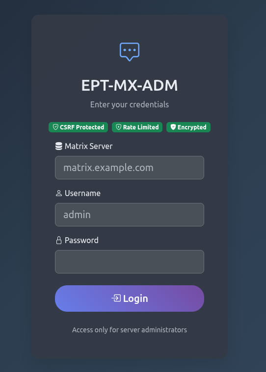

<div align="center">

# PROJECT NO LONGER MAINTAINED

## **Development has been discontinued**

**This project is no longer actively developed or maintained.**

### **Migration Notice**

We are building the **Matrix.Family ecosystem** — a comprehensive Matrix ecosystem that includes web client, Matrix server, administration panel, and other components.

**The new universal Matrix administration panel is located at:**  
**[https://github.com/EPTLLC/Matrix-Family-Admin](https://github.com/EPTLLC/Matrix-Family-Admin)**

All future development, updates, and support for the Matrix administration panel will be provided in the new repository as part of the Matrix.Family ecosystem.

---

</div>

# EPT-MX-ADM v1.0.1

[](https://pypi.org/project/ept-mx-adm/)
[](https://pypi.org/project/ept-mx-adm/)
[](https://opensource.org/licenses/MIT)
[](https://pypi.org/project/ept-mx-adm/)

```
  _____ ____ _____     __  ____   __      _    ____  __  __ 
 | ____|  _ \_   _|   |  \/  \ \ / /     / \  |  _ \|  \/  |
 |  _| | |_) || |_____|  |\/  |\ \  /____/ _ \ | | | | |\/| |
 | |___|  __/ | |_____|  |  | |/ /  \___/ ___ \| |_| | |  | |
 |_____|_|    |_|     |__|  |_/_/\_\  /_/   \_\____/|_|  |_|
```

**Web-Based Administration Panel for Matrix Synapse Server**

Universal admin tool that works with ANY Matrix server - local, remote, cloud, or self-hosted. Just admin credentials needed.



---

## Table of Contents

- [Features](#features)
- [Requirements](#requirements)
- [Installation](#installation)
- [Configuration](#configuration)
- [Running the Application](#running-the-application)
- [Usage](#usage)
- [Localization](#localization)
- [Production Deployment](#production-deployment)
- [Troubleshooting](#troubleshooting)
- [Security](#security)
- [Contributing](#contributing)
- [License](#license)
- [Support](#support)

---

## Features

### Universal Compatibility
- Works with ANY Matrix server (local, remote, cloud, self-hosted)
- Supports self-signed SSL certificates
- No complex configuration needed
- Multi-server support in one installation

### Dashboard
- Real-time server statistics
- User analytics (active, deactivated, total)
- Room statistics and analytics
- Media storage monitoring
- API health status
- Synapse version information
- Python version display

### User Management
- View all users with pagination
- Create new users
- Edit user profiles and settings
- Deactivate/reactivate users
- Reset user passwords
- View user devices and sessions
- Media storage per user
- Filter by guests and deactivated users
- CSV export/import
- Advanced search functionality

### Room Management
- List all rooms with detailed information
- View room details and statistics
- Edit room settings
- Delete rooms
- Unblock rooms
- Assign room administrators
- Column visibility toggles
- Advanced filtering and search
- CSV export
- Pagination with customizable rows per page

### Space Management
- List all Matrix spaces
- View space hierarchies
- Manage space settings
- Consistent pagination
- Modern card-based UI

### Media Management
- Overall media statistics dashboard
- Users with media list
- Detailed user media files view
- File type filtering (Images, Videos, Audio, Documents, Other)
- Quarantine system for suspicious files
- Media file deletion
- CSV export
- Human-readable file sizes
- Status filtering (Normal, Quarantined)

### Authentication & Security
- Simplified login form
- Server auto-detection
- Username auto-formatting
- Real Matrix admin rights verification
- Session management
- SSL certificate support
- Secure API integration

### Localization
- Multi-language support: English, Russian, German, French, Italian, Spanish, Turkish, Arabic, Hebrew, Japanese, Chinese
- Easy language switching
- Full interface translation
- RTL support ready

### Modern UI/UX
- Responsive design for all devices
- Dark/Light theme toggle
- Bootstrap 5 framework
- Bootstrap Icons
- Chart.js for analytics
- Smooth animations
- Modal dialogs
- Toast notifications

---

## Requirements

### System Requirements
- **Python**: 3.8 or higher
- **pip**: Latest version recommended
- **Operating System**: Linux, macOS (Windows with WSL or manual setup)

### Matrix Server Requirements
- **Matrix Synapse**: Any version with Admin API enabled
- **Admin Account**: User with admin privileges on the Matrix server
- **Network Access**: HTTP/HTTPS access to Matrix server

### Python Dependencies
All dependencies are listed in `requirements.txt`:
- Flask >= 2.3.0
- requests >= 2.31.0
- Jinja2 >= 3.1.0
- MarkupSafe >= 2.1.0
- werkzeug >= 2.3.0

---

## Installation

### Quick Start (PyPI - Recommended)

```bash
# Install from PyPI
pip install ept-mx-adm

# Download static assets
cd $(pip show ept-mx-adm | grep Location | cut -d' ' -f2)/ept-mx-adm
chmod +x install_assets.sh
./install_assets.sh

# Run the application
python -m ept-mx-adm
# or
ept-mx-adm
```

### Installation from Source

#### Option 1: Simple Installation
```bash
# Clone the repository
git clone https://github.com/EPTLLC/EPT-MX-ADM.git
cd EPT-MX-ADM

# Install dependencies
pip install -r requirements.txt

# Download static assets
chmod +x install_assets.sh
./install_assets.sh

# Run the application
python app.py
```

#### Option 2: Using Helper Script
```bash
# Clone the repository
git clone https://github.com/EPTLLC/EPT-MX-ADM.git
cd EPT-MX-ADM

# Make script executable
chmod +x run.sh

# Run (auto-installs dependencies and starts app)
./run.sh
```

#### Option 3: With Virtual Environment
```bash
# Clone the repository
git clone https://github.com/EPTLLC/EPT-MX-ADM.git
cd EPT-MX-ADM

# Create virtual environment
python3 -m venv venv

# Activate virtual environment
source venv/bin/activate  # On Windows: venv\Scripts\activate

# Upgrade pip
pip install --upgrade pip

# Install dependencies
pip install -r requirements.txt

# Download static assets
chmod +x install_assets.sh
./install_assets.sh

# Run the application
python app.py
```

#### Option 4: With pipx (Isolated)
```bash
# Install pipx if not already installed
python3 -m pip install --user pipx
python3 -m pipx ensurepath

# Clone and setup
git clone https://github.com/EPTLLC/EPT-MX-ADM.git
cd EPT-MX-ADM

# Install dependencies (pipx manages isolation)
pip install -r requirements.txt

# Download static assets
chmod +x install_assets.sh
./install_assets.sh

# Run
python app.py
```

#### Option 5: Windows (Manual Setup)
```cmd
# Clone the repository
git clone https://github.com/EPTLLC/EPT-MX-ADM.git
cd EPT-MX-ADM

# Create virtual environment
python -m venv venv

# Activate virtual environment
venv\Scripts\activate

# Install dependencies
pip install -r requirements.txt

# Download static assets manually or use WSL:
# - Download Bootstrap 5, Bootstrap Icons, Chart.js
# - Place in static/vendor/ folders
# - See install_assets.sh for URLs

# Run the application
python app.py
```

**Note for Windows users:**
- Shell scripts (.sh files) require WSL (Windows Subsystem for Linux) or Git Bash
- Alternatively, manually download static assets from CDN links in `install_assets.sh`
- Python application itself runs natively on Windows

---

## Configuration

### config.json

The main configuration file is `config.json` in the project root.

**Default Configuration:**
```json
{
  "matrix_server": "",
  "app": {
    "host": "0.0.0.0",
    "port": 5000,
    "debug": true
  },
  "language": "en"
}
```

**Configuration Options:**

| Parameter | Description | Default | Required |
|-----------|-------------|---------|----------|
| `matrix_server` | Default Matrix server URL (can be changed at login) | `""` | No |
| `app.host` | Application host | `0.0.0.0` | Yes |
| `app.port` | Application port | `5000` | Yes |
| `app.debug` | Debug mode (disable in production!) | `true` | Yes |
| `language` | Default interface language | `en` | Yes |

### Environment Variables (v1.0.1+)

**Required for Production:**

| Variable | Description | Example | Default |
|----------|-------------|---------|---------|
| `FLASK_SECRET_KEY` | Session encryption key (min 32 chars) | `your-secret-key-here` | Auto-generated in debug |

**Optional (Security):**

| Variable | Description | Example | Default |
|----------|-------------|---------|---------|
| `EPT_DISABLE_SSL_VERIFY` | Disable SSL verification (dev only!) | `true` | `false` |
| `EPT_CA_BUNDLE` | Path to CA bundle for custom certificates | `/path/to/ca.crt` | System default |

### Important Notes

1. **Matrix Server**: The `matrix_server` in config.json is optional - specify any server at login
2. **Secret Key**: `FLASK_SECRET_KEY` environment variable is REQUIRED in production (min 32 characters)
3. **Debug Mode**: Set `app.debug` to `false` in production
4. **SSL Verification**: Enabled by default in v1.0.1+ for security
5. **Self-Signed Certificates**: Use `EPT_CA_BUNDLE` or `EPT_DISABLE_SSL_VERIFY=true` (dev only)

---

## Running the Application

### Development Mode

```bash
# Activate virtual environment if using one
source venv/bin/activate  # On Windows: venv\Scripts\activate

# Run the application
python app.py
```

The application will start on `http://127.0.0.1:5000` (or the host/port specified in config.json).

### Production Mode (Gunicorn)

```bash
# Activate virtual environment if using one
source venv/bin/activate

# Run with Gunicorn
gunicorn -c gunicorn.conf.py app:app
```

### Systemd Service (Linux)

Create `/etc/systemd/system/ept-mx-adm.service`:

```ini
[Unit]
Description=EPT-MX-ADM Matrix Admin Panel
After=network.target

[Service]
Type=notify
User=your-user
Group=your-group
WorkingDirectory=/path/to/EPT-MX-ADM
Environment="PATH=/path/to/EPT-MX-ADM/venv/bin"
ExecStart=/path/to/EPT-MX-ADM/venv/bin/gunicorn -c gunicorn.conf.py app:app
Restart=always
RestartSec=10

[Install]
WantedBy=multi-user.target
```

Enable and start:
```bash
sudo systemctl daemon-reload
sudo systemctl enable ept-mx-adm
sudo systemctl start ept-mx-adm
sudo systemctl status ept-mx-adm
```

---

## Usage

### First Login

1. Open your browser and navigate to `http://localhost:5000` (or your configured host:port)

2. **Login Form:**
   - **Matrix Server**: Enter your server domain (e.g., `matrix.example.com` or `localhost`)
     - No need for `https://` - it's added automatically
     - Works with local servers, remote servers, and self-signed certificates
   
   - **Username**: Enter your admin username (e.g., `admin`)
     - No need for `@` or domain - it's formatted automatically
   
   - **Password**: Enter your Matrix admin password

3. Click "Login"

The application will:
- Automatically format the server URL (add `https://` if needed)
- Automatically format the username into Matrix ID (add `@` and domain)
- Verify admin privileges via Matrix API
- Create a session for your admin user

### Managing Users

**View Users:**
- Navigate to "Users" tab
- See all users with pagination
- Filter by guests and deactivated users
- View media storage per user

**Create User:**
- Click "Create User" button
- Fill in username, password, and optional display name
- Choose if user should be admin
- Click "Create"

**Edit User:**
- Click on user card dropdown menu
- Select "Edit"
- Modify user settings
- Save changes

**Deactivate User:**
- Click on user dropdown menu
- Select "Deactivate"
- Confirm action

### Managing Rooms

**View Rooms:**
- Navigate to "Rooms" tab
- See all rooms with statistics
- Toggle column visibility
- Use search to find specific rooms

**View Room Details:**
- Click "View" button on room card
- See detailed information in modal
- View members, settings, and statistics

**Edit Room:**
- Click dropdown menu on room card
- Select "Edit"
- Modify room settings
- Save changes

**Delete Room:**
- Click dropdown menu
- Select "Delete"
- Confirm action (room will be permanently deleted)

### Managing Media

**View Media Statistics:**
- Navigate to "Media" tab
- See overall statistics dashboard
- View total files, storage, and users with media

**View User Media:**
- Click on user in media list
- See all media files for that user
- Filter by file type (Images, Videos, Audio, Documents, Other)
- Filter by status (Normal, Quarantined)

**Quarantine Media:**
- In user media view, click dropdown on file
- Select "Quarantine"
- File will be marked as quarantined

**Delete Media:**
- Click dropdown on file
- Select "Delete"
- Confirm action

### Managing Spaces

**View Spaces:**
- Navigate to "Spaces" tab
- See all Matrix spaces
- View space hierarchies
- Manage space settings

---

## Localization

EPT-MX-ADM supports multiple languages out of the box.

### Available Languages
- English (en)
- Russian (ru)
- German (de)
- French (fr)
- Italian (it)
- Spanish (es)
- Turkish (tr)
- Arabic (ar)
- Hebrew (he)
- Japanese (ja)
- Chinese (zh)

### Changing Language

**In Application:**
1. Click on language selector in top navigation
2. Choose your preferred language
3. Interface will update immediately
4. Language preference is saved in session

**Adding New Language:**
1. Copy `locales/en/messages.json` to `locales/[language_code]/messages.json`
2. Translate all strings in the new file
3. Language will be automatically detected and available

---

## Production Deployment

### Security Checklist (v1.0.1+)

**Critical (Required):**
- [ ] Set `FLASK_SECRET_KEY` environment variable (min 32 chars, use `secrets.token_hex(32)`)
- [ ] Set `app.debug` to `false` in config.json
- [ ] Enable SSL verification (`EPT_DISABLE_SSL_VERIFY=false` or unset)
- [ ] Use HTTPS only (via reverse proxy with valid certificates)
- [ ] Verify CSRF protection is enabled (default in v1.0.1+)
- [ ] Verify rate limiting is active (5 login attempts per minute)

**High Priority:**
- [ ] Use strong, unique passwords for all admin accounts
- [ ] Restrict network access (firewall, VPN, IP whitelist)
- [ ] Enable security headers (X-Frame-Options, CSP, HSTS) via reverse proxy
- [ ] Set up centralized logging and monitoring
- [ ] Configure log retention and rotation
- [ ] Keep Python and all dependencies up to date
- [ ] Enable Dependabot or automated security scanning

**Recommended:**
- [ ] Use systemd service with non-root user
- [ ] Regular automated backups of config.json and application data
- [ ] Monitor for suspicious activity and failed login attempts
- [ ] Implement intrusion detection/prevention (fail2ban, OSSEC)
- [ ] Run vulnerability scans (bandit, pip-audit) regularly
- [ ] Document incident response procedures
- [ ] Set up SSL/TLS certificate auto-renewal (Let's Encrypt)

### Environment Setup

**Generate SECRET_KEY:**
```bash
python3 -c 'import secrets; print(secrets.token_hex(32))'
```

**Set Environment Variables:**
```bash
# Required for production
export FLASK_SECRET_KEY="your-generated-secret-key-here"

# Optional: For custom CA certificates
export EPT_CA_BUNDLE="/path/to/your/ca-bundle.crt"

# NEVER set this in production:
# export EPT_DISABLE_SSL_VERIFY=true
```

**systemd Service with Environment:**
```ini
[Service]
Environment="FLASK_SECRET_KEY=your-secret-key-here"
Environment="EPT_CA_BUNDLE=/path/to/ca-bundle.crt"
```

### Nginx Configuration Example

```nginx
server {
    listen 80;
    server_name admin.yourdomain.com;
    
    # Redirect to HTTPS
    return 301 https://$server_name$request_uri;
}

server {
    listen 443 ssl http2;
    server_name admin.yourdomain.com;
    
    # SSL certificates
    ssl_certificate /path/to/cert.pem;
    ssl_certificate_key /path/to/key.pem;
    
    # Modern SSL configuration
    ssl_protocols TLSv1.2 TLSv1.3;
    ssl_ciphers HIGH:!aNULL:!MD5;
    ssl_prefer_server_ciphers on;
    
    # Security headers
    add_header Strict-Transport-Security "max-age=31536000; includeSubDomains" always;
    add_header X-Frame-Options "SAMEORIGIN" always;
    add_header X-Content-Type-Options "nosniff" always;
    add_header X-XSS-Protection "1; mode=block" always;
    add_header Referrer-Policy "no-referrer-when-downgrade" always;
    add_header Content-Security-Policy "default-src 'self'; script-src 'self' 'unsafe-inline'; style-src 'self' 'unsafe-inline'; img-src 'self' data:; font-src 'self' data:;" always;
    
    # Rate limiting
    limit_req_zone $binary_remote_addr zone=login:10m rate=5r/m;
    
    location / {
        proxy_pass http://127.0.0.1:5000;
        proxy_set_header Host $host;
        proxy_set_header X-Real-IP $remote_addr;
        proxy_set_header X-Forwarded-For $proxy_add_x_forwarded_for;
        proxy_set_header X-Forwarded-Proto $scheme;
        
        # Timeouts
        proxy_connect_timeout 60s;
        proxy_send_timeout 60s;
        proxy_read_timeout 60s;
    }
    
    # Apply rate limiting to login
    location /login {
        limit_req zone=login burst=3 nodelay;
        proxy_pass http://127.0.0.1:5000;
        proxy_set_header Host $host;
        proxy_set_header X-Real-IP $remote_addr;
        proxy_set_header X-Forwarded-For $proxy_add_x_forwarded_for;
        proxy_set_header X-Forwarded-Proto $scheme;
    }
}
```

### Apache Configuration Example

```apache
<VirtualHost *:80>
    ServerName admin.yourdomain.com
    Redirect permanent / https://admin.yourdomain.com/
</VirtualHost>

<VirtualHost *:443>
    ServerName admin.yourdomain.com
    
    SSLEngine on
    SSLCertificateFile /path/to/cert.pem
    SSLCertificateKeyFile /path/to/key.pem
    
    ProxyPass / http://127.0.0.1:5000/
    ProxyPassReverse / http://127.0.0.1:5000/
    
    ProxyPreserveHost On
    RequestHeader set X-Forwarded-Proto "https"
</VirtualHost>
```

---

## Troubleshooting

### Common Issues

#### "Connection refused" or "Cannot connect to Matrix server"
**Solution:**
- Verify Matrix server URL is correct
- Check if Matrix server is running
- Ensure network connectivity
- For local servers, try `localhost` or `127.0.0.1`
- Check firewall rules

#### "SSL: CERTIFICATE_VERIFY_FAILED" error
**Solution (v1.0.1+):**
- SSL verification is enabled by default for security
- For development with self-signed certificates: `export EPT_DISABLE_SSL_VERIFY=true`
- For production with custom CA: `export EPT_CA_BUNDLE=/path/to/ca-bundle.crt`
- For production: use valid SSL certificates via reverse proxy
- Check if Matrix server certificate is properly configured

#### "Invalid credentials" or "Not an admin"
**Solution:**
- Verify username and password are correct
- Ensure user has admin privileges on Matrix server
- Check if user is deactivated
- Try logging in via Matrix client first to verify credentials

#### Login form only shows username/password (no server field)
**Solution:**
- This is normal - server field is optional
- Enter server domain at login or use default from config.json
- Server field will be shown after first failed attempt

#### Dashboard shows "N/A" or "0" for statistics
**Solution:**
- Verify admin API is enabled on Matrix server
- Check if user has proper admin rights
- Wait a few seconds for data to load
- Check browser console for errors
- Verify Matrix server API endpoints are accessible

#### Pagination not working (users/rooms/spaces)
**Solution:**
- Clear browser cache and reload
- Check browser console for JavaScript errors
- Verify API responses in Network tab
- Ensure using latest version of EPT-MX-ADM

#### Media page shows "Error loading media data"
**Solution:**
- Verify `/v1/statistics/users/media` endpoint is available on Matrix server
- Check if user has admin rights
- Clear browser cache
- Check server logs for errors

---

## Security

### Security Features (v1.0.1+)

EPT-MX-ADM v1.0.1 includes comprehensive security hardening:

**Authentication & Session:**
- CSRF protection on all POST/PUT/DELETE requests
- Rate limiting (5 login attempts per minute per IP)
- Secure session cookies (HttpOnly, Secure, SameSite)
- Required SECRET_KEY (min 32 bytes, env variable only)
- Admin privilege verification via Matrix API

**Network Security:**
- SSL/TLS verification enabled by default
- Support for custom CA bundles
- Security headers (X-Frame-Options, CSP, HSTS, etc.)
- Input sanitization and validation

**Monitoring & Logging:**
- All admin actions logged with IP addresses
- Failed login attempt tracking
- No sensitive data (passwords/tokens) in logs
- Configurable log retention

**Development:**
- Pre-commit hooks for secret detection
- Automated dependency vulnerability scanning
- Static security analysis (Bandit)
- Comprehensive security test suite

### Best Practices

1. **Environment Variables**: Use `FLASK_SECRET_KEY` env variable, never hardcode secrets
2. **SSL/TLS**: Enable verification in production, use `EPT_CA_BUNDLE` for custom CAs
3. **Passwords**: Enforce strong, unique passwords for all admin accounts
4. **Debug Mode**: Always set `app.debug=false` in production
5. **HTTPS**: Use HTTPS only via reverse proxy with valid certificates
6. **Access Control**: Restrict network access (firewall, VPN, IP whitelist)
7. **Updates**: Keep Python, Flask, and dependencies up to date (use Dependabot)
8. **Monitoring**: Enable centralized logging and monitor for suspicious activity
9. **Backups**: Regular automated backups of config and application data
10. **Security Scanning**: Run `bandit` and `pip-audit` regularly

### SSL/TLS Configuration

**Production (Recommended):**
```bash
# Use system CA bundle (default, most secure)
unset EPT_DISABLE_SSL_VERIFY
unset EPT_CA_BUNDLE
```

**Custom CA Certificates:**
```bash
# For internal/corporate CAs
export EPT_CA_BUNDLE="/path/to/your/ca-bundle.crt"
```

**Development Only (NOT for production):**
```bash
# ONLY for development with self-signed certificates
export EPT_DISABLE_SSL_VERIFY=true
```

### Security Documentation

For comprehensive security information, see:
- [SECURITY.md](SECURITY.md) - Security policy and vulnerability reporting
- [DOCKER.md](DOCKER.md) - Secure Docker deployment
- [CHANGELOG.md](CHANGELOG.md) - Security fixes and updates

---

## Contributing

We welcome contributions to EPT-MX-ADM!

### How to Contribute

1. **Fork** the repository
2. **Create** a feature branch (`git checkout -b feature/amazing-feature`)
3. **Commit** your changes (`git commit -m 'Add amazing feature'`)
4. **Push** to the branch (`git push origin feature/amazing-feature`)
5. **Open** a Pull Request

### Development Guidelines

- Follow PEP 8 style guide for Python code
- Add comments and docstrings
- Update documentation for new features
- Test your changes thoroughly
- Update CHANGELOG.md

### Reporting Issues

Found a bug or have a feature request?

1. Check if issue already exists
2. Create new issue with detailed description
3. Include steps to reproduce (for bugs)
4. Provide environment details (OS, Python version, Matrix Synapse version)

---

## License

This project is licensed under the MIT License - see the [LICENSE](LICENSE) file for details.

MIT License allows you to:
- Use the software for any purpose
- Modify the source code
- Distribute copies
- Include in proprietary software

With the following conditions:
- Include the original license and copyright notice
- Provide attribution to original authors

---

## Support

### Support Policy

**No Support Provided**: This project is released as-is without support, consultation, or assistance.

**Community Contributions**: Development contributions are welcome but not obligated.

### Resources

- **Documentation**: [README.md](README.md) and [CHANGELOG.md](CHANGELOG.md)
- **Issues**: [GitHub Issues](https://github.com/EPTLLC/EPT-MX-ADM/issues) - for bug reports only
- **Community**: [@EasyProTech](https://t.me/EasyProTech)

---

## Project Information

- **Project Name**: EPT-MX-ADM
- **Version**: 1.0.1
- **Status**: Production Ready
- **PyPI**: [pypi.org/project/ept-mx-adm](https://pypi.org/project/ept-mx-adm/)
- **Company**: EasyProTech LLC
- **Website**: [www.easypro.tech](https://www.easypro.tech)
- **Developer**: Brabus
- **Repository**: [github.com/EPTLLC/EPT-MX-ADM](https://github.com/EPTLLC/EPT-MX-ADM)
- **License**: MIT
- **Python**: 3.8+
- **Supported Languages**: EN, RU, DE, FR, IT, ES, TR, AR, HE, JA, ZH

---

## Acknowledgments

- **Matrix Foundation** for the Matrix protocol
- **Synapse Team** for the Matrix Synapse server
- **Flask Team** for the amazing web framework
- **Bootstrap Team** for the UI framework
- **Chart.js Team** for visualization library
- **Community Contributors** for feedback and contributions

---

## Changelog

For detailed history of changes, see [CHANGELOG.md](CHANGELOG.md).

---

**Created with care by EasyProTech LLC**

Visit us: [www.easypro.tech](https://www.easypro.tech) | Telegram: [@EasyProTech](https://t.me/EasyProTech)
