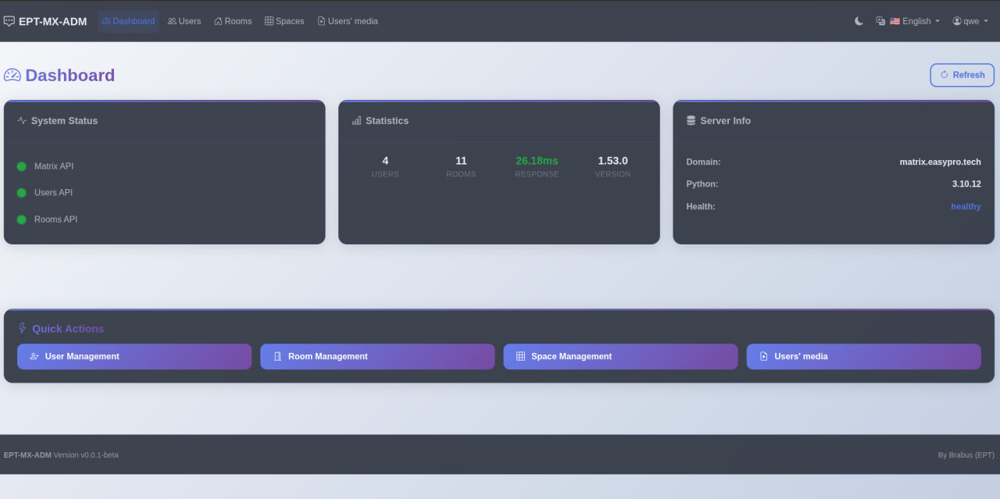
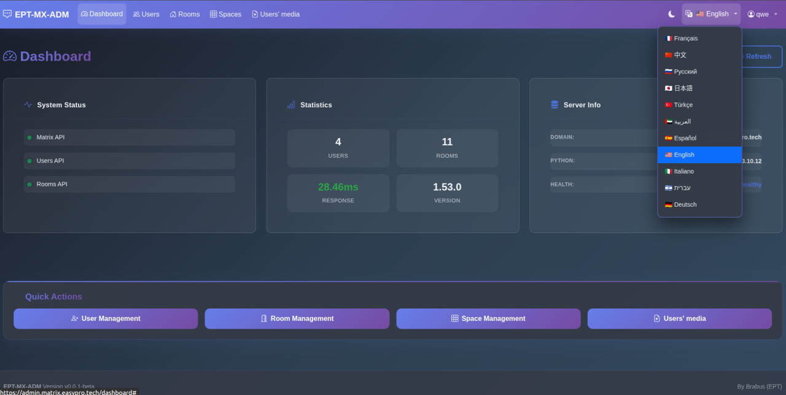
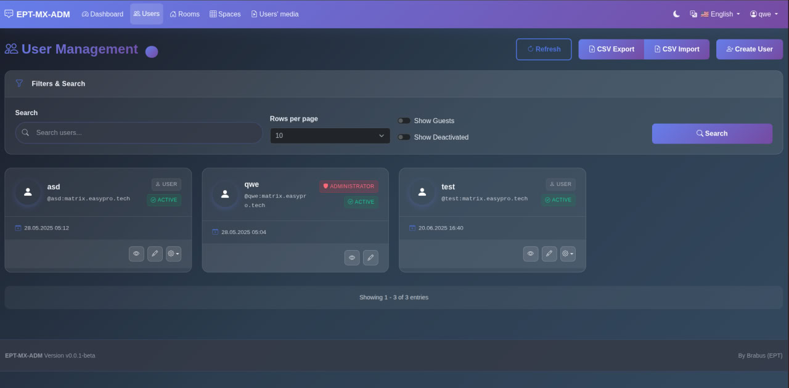
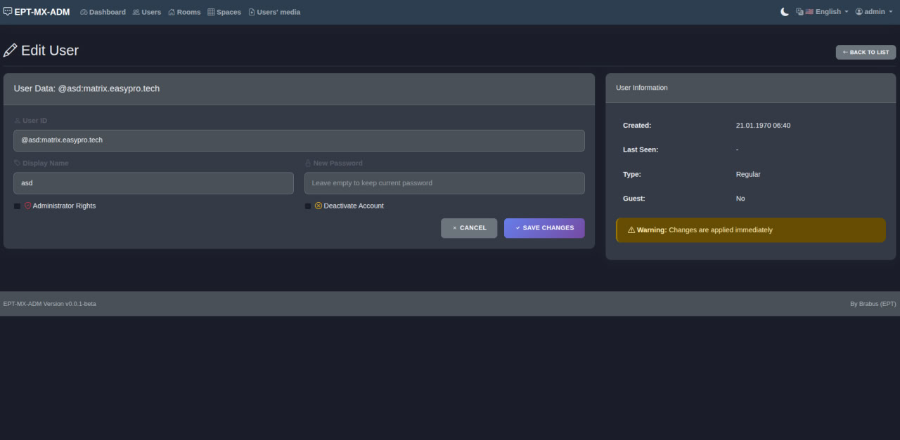
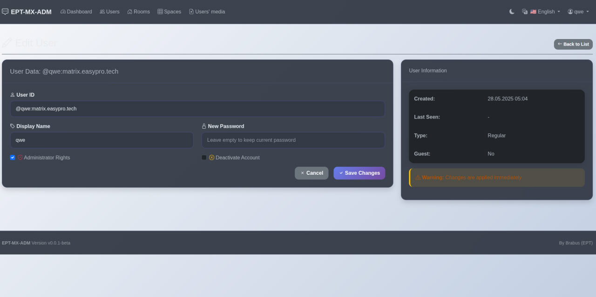
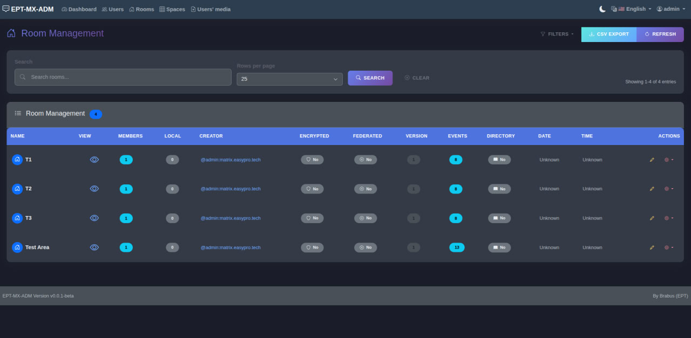
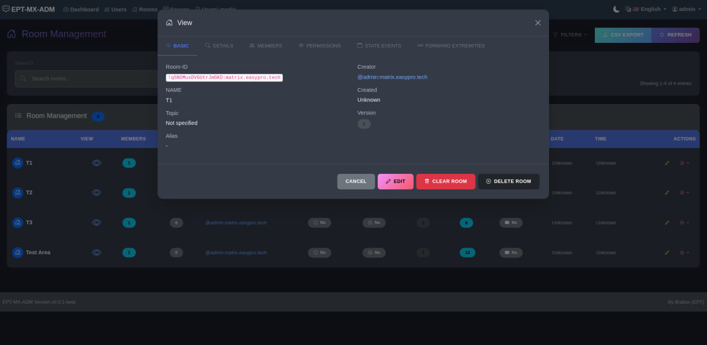
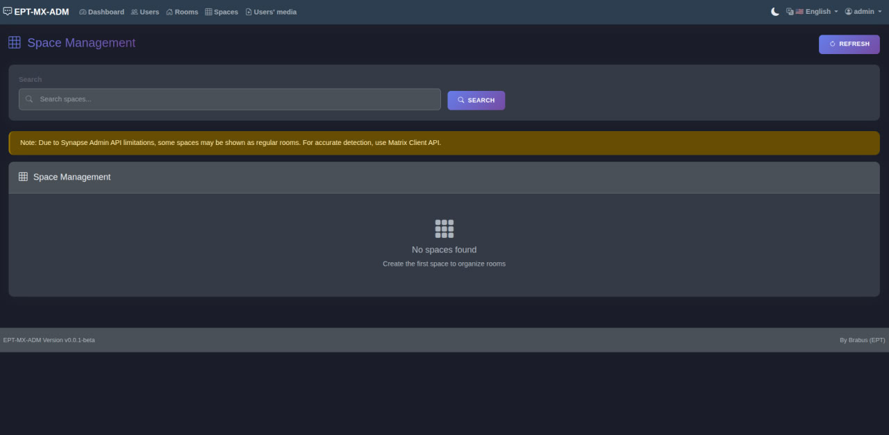
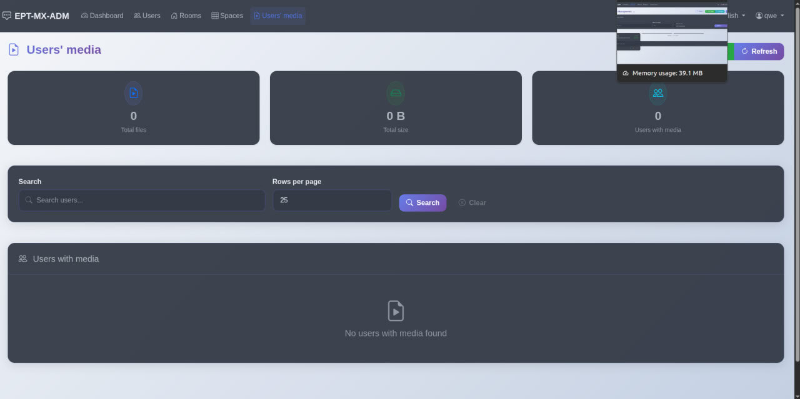

# 🚀 EPT-MX-ADM v0.0.1-beta

```
  _____ ____ _____     __  ____   __      _    ____  __  __ 
 | ____|  _ \_   _|   |  \/  \ \/  /     / \  |  _ \|  \/  |
 |  _| | |_) || |_____|  |\/| |\  /_____/ _ \ | | | | |\/| |
 | |___|  __/ | |_____|  |  | |/  \____/ ___ \| |_| | |  | |
 |_____|_|    |_|     |__|  |_/_/\_\  /_/   \_\____/|_|  |_|
```

Modern administration panel for Matrix Synapse server

**Created and maintained by [EasyProTech LLC](https://www.easypro.tech) • Developed by Brabus**


EPT-MX-ADM is a modern, user-friendly admin panel for Matrix Synapse, replacing outdated tools with a modular, multilingual interface and powerful features.

## 📑 Table of Contents

- [🎯 See It In Action](#-see-it-in-action-30-seconds)
- [⚠️ Beta Warning](#️-beta-version-warning)
- [🧪 Demo](#-demo--try-online)
- [💡 Why I Created This](#-why-i-created-ept-mx-adm)
- [🔥 Why EPT-MX-ADM?](#-why-ept-mx-adm)
- [✨ Features](#-features)
- [📸 Screenshots](#-screenshots)
- [🌍 Multilingual Support](#-multilingual-support)
- [🔧 Architecture](#-architecture-overview)
- [💻 System Requirements](#-system-requirements)
- [⚡ Performance](#-performance)
- [🛠️ Built With](#️-built-with)
- [📊 Comparison](#-ept-mx-adm-vs-others)
- [🚀 Quick Start](#-quick-start)
- [⚡ Troubleshooting](#-common-issues--solutions)
- [🗺️ Roadmap](#️-roadmap)
- [📝 License](#-license)
- [🤝 Contributing](#-contributing)
- [📞 Support](#-support)

## 🎯 See It In Action (30 seconds)

```bash
# Clone, install, run - that's it!
git clone https://github.com/EPTLLC/EPT-MX-ADM.git
cd EPT-MX-ADM
pip3 install -r requirements.txt
python3 app.py
# Open http://localhost:5000
```

## ⚠️ BETA VERSION WARNING

**🚧 This is a BETA version (v0.0.1-beta) - Work in Progress!**

* 🔨 Many features are still under development
* 🐛 Bugs and issues are expected
* 📝 Documentation may be incomplete
* 🔄 Breaking changes may occur
* ⚡ Use at your own risk in production

This project is being developed in my spare time. There is **no support**, **no explanations**, and **no guarantees**. Use it if you like it — when I have time and inspiration, I'll improve it.

## 🧪 Demo / Try Online

Try EPT-MX-ADM live without installation:

* **Demo URL:** [https://admin.matrix.easypro.tech/](https://admin.matrix.easypro.tech/)
* **Username:** `qwe`
* **Password:** `qwe`

> ⚠️ This is a public demo instance. Changes are temporary and reset periodically. Do not upload sensitive data.

## 💡 Why I Created EPT-MX-ADM

> *From the author – Brabus*

Matrix is a powerful platform with terrible admin tools:

* Outdated Synapse Admin UI
* CORS errors everywhere
* Hours lost on Nginx config
* Vague, incomplete documentation

Admins waste time fighting tools. So I built one that works:

* Modular
* Multilingual (11 languages)
* Simple, modern UI
* Real dashboards and management tools

Created by [EasyProTech LLC](https://www.easypro.tech) — we build tools that solve real problems.

## 🔥 Why EPT-MX-ADM?

### Zero CORS Issues
Unlike Synapse Admin, works out of the box. No proxy configs, no CORS headers, no pain.

### Real-time Updates
See changes instantly. No page refreshes needed.

### Batch Operations
Select multiple users/rooms and manage them in one click.

### Dark Mode
Built-in theme switcher. Your eyes will thank you.

### Mobile Ready
Manage your server from your phone. Yes, really.

## ✨ Features

### 🎯 Current Functionality (Beta)

* 👥 User Management *(implemented)*
* 🏠 Room Management *(beta - deletion working)*
* 🌐 Space Management *(planned)*
* 📁 User Media Management *(beta)*
* 📊 Dashboard *(basic)*
* 🔐 Secure Authorization *(working)*
* 🌍 Multilingual (11 languages) *(complete)*
* 📱 Responsive Design *(in progress)*
* 🔍 Search *(limited)*

### 🚧 Planned Features

* 📈 Advanced Analytics
* 🌐 Federation Management
* 📋 Logs & Audit
* ⚙️ UI-based Configuration
* 🚨 Alerts & Monitoring

## 📸 Screenshots

### 🔐 Login Page


*Clean login interface • Language switcher • Dark/Light theme toggle*

### 📊 Dashboard


*Real-time server stats • User growth chart • Quick actions*

### 🌍 Language Selection


*11 languages • Instant switching • Flag icons for easy recognition*

### 👥 User Management


*Search & filter • Batch operations • Quick user actions*

### ✏️ Edit User


*Full profile control • Admin privileges • Account settings*

### 👤 User Profile


*Detailed user info • Room memberships • Media usage*

### 🏠 Room Management


*Room list • Search by name/ID • Quick moderation tools*

### 🏠 Room Details


*Room settings • Member list • Moderation actions*

### 🌐 Space Management


*Space hierarchy • Child rooms • Space settings*

### 📁 Media Management


*Media browser • Quarantine tools • Storage analytics*

## 🌍 Multilingual Support

Available Languages:
EN, RU, DE, FR, IT, ES, TR, ZH, JA, AR, HE

* Language switcher on login
* Flags for visual aid
* Localization includes interface, errors, tooltips, validation

## 🔧 Architecture Overview

Folder structure: `ept-mx-adm/`

* `app.py` – main Flask app
* `gunicorn.conf.py`, `requirements.txt`, `settings.py`
* `blueprints/` – routes
* `modules/` – core logic
* `utils/` – helpers, logging, Matrix API
* `locales/` – translations (11 JSON files)
* `static/`, `templates/`, `logs/`, `screen/`

## 💻 System Requirements

* **RAM:** 512MB minimum (1GB recommended)
* **Disk:** 100MB for app + logs
* **CPU:** Any modern processor
* **OS:** Linux, macOS, Windows (with WSL)
* **Network:** Access to Matrix homeserver

## ⚡ Performance

* Handles 10,000+ users without breaking a sweat
* Lazy loading for large datasets
* Caching for repeated API calls
* Average response time: <100ms

## 🛠️ Built With

* **Flask** - Because Django is overkill
* **Bootstrap 5** - Modern, responsive, fast
* **Chart.js** - Beautiful analytics
* **No jQuery** - Pure vanilla JS
* **No database** - Matrix is the database

## 📊 EPT-MX-ADM vs Others

| Feature | EPT-MX-ADM | Synapse Admin | Element Web |
|---------|------------|---------------|-------------|
| No CORS issues | ✅ | ❌ | ❌ |
| 11 Languages | ✅ | ❌ | ✅ |
| Dark Mode | ✅ | ❌ | ✅ |
| Mobile UI | ✅ | ❌ | ✅ |
| Batch Operations | ✅ | ❌ | ❌ |
| Real Analytics | ✅ | ❌ | ❌ |

## 🚀 Quick Start

### Deployment Recommendations (Linux):

```bash
/opt/ept-mx-adm/
/var/www/matrix-admin/
/home/matrix/admin/
```

Permissions:

* Separate user (e.g., `matrix-admin`)
* Folders 755, files 644
* Don't run as root

### Install

```bash
sudo useradd -r -s /bin/bash -d /opt/ept-mx-adm matrix-admin
sudo mkdir -p /opt/ept-mx-adm
sudo chown matrix-admin:matrix-admin /opt/ept-mx-adm
sudo -u matrix-admin bash
cd /opt/ept-mx-adm
git clone https://github.com/EPTLLC/EPT-MX-ADM.git .
```

### Requirements

* Python 3.10+
* Matrix Synapse with Admin API enabled
* Admin Matrix account

### One-Line Setup

```bash
pip3 install -r requirements.txt && \
mkdir -p static/vendor/{bootstrap/{css,js},bootstrap-icons/fonts,chartjs} && \
curl -o static/vendor/bootstrap/css/bootstrap.min.css https://cdn.jsdelivr.net/npm/bootstrap@5.3.0/dist/css/bootstrap.min.css && \
curl -o static/vendor/bootstrap/js/bootstrap.bundle.min.js https://cdn.jsdelivr.net/npm/bootstrap@5.3.0/dist/js/bootstrap.bundle.min.js && \
curl -o static/vendor/bootstrap-icons/bootstrap-icons.css https://cdn.jsdelivr.net/npm/bootstrap-icons@1.10.0/font/bootstrap-icons.css && \
curl -o static/vendor/bootstrap-icons/fonts/bootstrap-icons.woff https://cdn.jsdelivr.net/npm/bootstrap-icons@1.10.0/font/fonts/bootstrap-icons.woff && \
curl -o static/vendor/bootstrap-icons/fonts/bootstrap-icons.woff2 https://cdn.jsdelivr.net/npm/bootstrap-icons@1.10.0/font/fonts/bootstrap-icons.woff2 && \
curl -o static/vendor/chartjs/chart.min.js https://cdn.jsdelivr.net/npm/chart.js && \
sed -i 's|https://cdn.jsdelivr.net/npm/bootstrap-icons@1.10.0/font/fonts/|../bootstrap-icons/fonts/|g' static/vendor/bootstrap-icons/bootstrap-icons.css && \
echo "✅ EPT-MX-ADM ready to run!"
```

> For offline install, manually download and place assets in `static/vendor/`

### Configuration

Edit `config/settings.py`:

```python
SYNAPSE_URL = "https://your-domain.com"
DEFAULT_LOCALE = "en"
```

### Launch

```bash
python3 app.py
# or in background:
nohup python3 app.py > logs/app.log 2>&1 &
# or with Gunicorn:
gunicorn -w 4 -b 0.0.0.0:5000 app:app
```

Use a reverse proxy (e.g., Nginx + HTTPS).

## ⚡ Common Issues & Solutions

**Can't login?**
→ Check you're using full Matrix ID: `@username:domain.com`

**Empty dashboard?**
→ Verify your account has admin privileges

**Connection refused?**
→ Check `SYNAPSE_URL` in settings matches your setup

**Spaces showing as rooms?**
→ Known Synapse Admin API limitation. Use Matrix Client API for accurate detection.

## 🗺️ Roadmap

### v0.1.0 (Q1 2025)
- [x] Room deletion functionality
- [ ] Advanced room management (permissions, settings)
- [ ] Space hierarchy view
- [ ] Bulk user operations

### v0.2.0 (Q2 2025)
- [ ] Federation management
- [ ] Advanced analytics
- [ ] Export/import tools

### v1.0.0 (Q3 2025)
- [ ] Stable release
- [ ] Plugin system
- [ ] API documentation

## 📝 License

Licensed under the [MIT License](LICENSE) by EasyProTech LLC — created by Brabus.
**No support is provided. Use at your own risk.**

## 🤝 Contributing

Pull Requests welcome. See `CONTRIBUTING.md`.

## 📞 Support

I do **not** provide support.
I do **not** consult — not for free, not for money, not in any form.

Please don't ask for help, fixes, or explanations — this project is released as-is.

If someone wants to help with development — contributions are welcome.
But there are **no obligations from my side** whatsoever.

## 🌐 Localized Descriptions

### 🇬🇧 English: Modern administration panel for Matrix Synapse.

### 🇷🇺 Русский: Современная панель администратора для Matrix Synapse.

### 🇩🇪 Deutsch: Modernes Administrationspanel für Matrix Synapse.

### 🇫🇷 Français: Panneau d'administration moderne pour Matrix Synapse.

### 🇮🇹 Italiano: Pannello di amministrazione moderno per Matrix Synapse.

### 🇪🇸 Español: Panel de administración moderno para Matrix Synapse.

### 🇹🇷 Türkçe: Matrix Synapse için modern yönetim paneli.

### 🇨🇳 中文: 现代化的 Matrix Synapse 管理面板。

### 🇯🇵 日本語: モダンな Matrix Synapse 管理パネル。

### 🇦🇪 العربية: لوحة إدارة حديثة لـ Matrix Synapse.

### 🇮🇱 עברית: פאנל ניהול מודרני ל-Matrix Synapse.