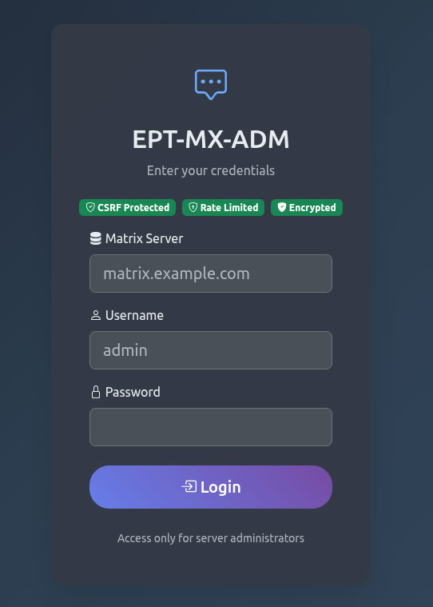

# EPT-MX-ADM v1.0.1

[](https://pypi.org/project/ept-mx-adm/)
[](https://pypi.org/project/ept-mx-adm/)
[](https://opensource.org/licenses/MIT)
[](https://pypi.org/project/ept-mx-adm/)

```
  _____ ____ _____     __  ____   __      _    ____  __  __ 
 | ____|  _ \_   _|   |  \/  \ \ / /     / \  |  _ \|  \/  |
 |  _| | |_) || |_____|  |\/  |\ \  /____/ _ \ | | | | |\/| |
 | |___|  __/ | |_____|  |  | |/ /  \___/ ___ \| |_| | |  | |
 |_____|_|    |_|     |__|  |_/_/\_\  /_/   \_\____/|_|  |_|
```

**Веб-панель администрирования для Matrix Synapse сервера**

Универсальный инструмент администрирования, работающий с ЛЮБЫМ Matrix сервером - локальным, удаленным, облачным или самостоятельно размещенным. Требуются только учетные данные администратора.



---

## Содержание

- [Возможности](#возможности)
- [Требования](#требования)
- [Установка](#установка)
- [Конфигурация](#конфигурация)
- [Запуск приложения](#запуск-приложения)
- [Использование](#использование)
- [Локализация](#локализация)
- [Развертывание в продакшене](#развертывание-в-продакшене)
- [Устранение неполадок](#устранение-неполадок)
- [Безопасность](#безопасность)
- [Участие в разработке](#участие-в-разработке)
- [Лицензия](#лицензия)
- [Поддержка](#поддержка)

---

## Возможности

### Универсальная совместимость
- Работает с ЛЮБЫМ Matrix сервером (локальным, удаленным, облачным, самостоятельно размещенным)
- Поддержка самоподписанных SSL сертификатов
- Не требует сложной конфигурации
- Поддержка нескольких серверов в одной установке

### Панель управления
- Статистика сервера в реальном времени
- Аналитика пользователей (активные, деактивированные, всего)
- Статистика и аналитика комнат
- Мониторинг хранилища медиа
- Статус работоспособности API
- Информация о версии Synapse
- Отображение версии Python

### Управление пользователями
- Просмотр всех пользователей с пагинацией
- Создание новых пользователей
- Редактирование профилей и настроек пользователей
- Деактивация/реактивация пользователей
- Сброс паролей пользователей
- Просмотр устройств и сессий пользователей
- Хранилище медиа на пользователя
- Фильтрация по гостям и деактивированным пользователям
- Экспорт/импорт CSV
- Расширенный поиск

### Управление комнатами
- Список всех комнат с подробной информацией
- Просмотр деталей и статистики комнат
- Редактирование настроек комнат
- Удаление комнат
- Разблокировка комнат
- Назначение администраторов комнат
- Переключатели видимости столбцов
- Расширенная фильтрация и поиск
- Экспорт CSV
- Пагинация с настраиваемыми строками на странице

### Управление пространствами
- Список всех Matrix пространств
- Просмотр иерархий пространств
- Управление настройками пространств
- Согласованная пагинация
- Современный UI на основе карточек

### Управление медиа
- Панель общей статистики медиа
- Список пользователей с медиа
- Подробный просмотр медиа файлов пользователей
- Фильтрация по типам файлов (Изображения, Видео, Аудио, Документы, Другое)
- Система карантина для подозрительных файлов
- Удаление медиа файлов
- Экспорт CSV
- Читаемые размеры файлов
- Фильтрация по статусу (Нормальный, На карантине)

### Аутентификация и безопасность
- Упрощенная форма входа
- Автоопределение сервера
- Автоматическое форматирование имени пользователя
- Реальная проверка прав администратора Matrix
- Управление сессиями
- Поддержка SSL сертификатов
- Безопасная интеграция с API

### Локализация
- Поддержка нескольких языков: Английский, Русский, Немецкий, Французский, Итальянский, Испанский, Турецкий, Арабский, Иврит, Японский, Китайский
- Простое переключение языков
- Полный перевод интерфейса
- Готова поддержка RTL

### Современный UI/UX
- Адаптивный дизайн для всех устройств
- Переключатель темной/светлой темы
- Фреймворк Bootstrap 5
- Bootstrap Icons
- Chart.js для аналитики
- Плавные анимации
- Модальные диалоги
- Всплывающие уведомления

---

## Требования

### Системные требования
- **Python**: 3.8 или выше
- **pip**: Рекомендуется последняя версия
- **Операционная система**: Linux, macOS (Windows с WSL или ручная настройка)

### Требования к Matrix серверу
- **Matrix Synapse**: Любая версия с включенным Admin API
- **Учетная запись администратора**: Пользователь с правами администратора на Matrix сервере
- **Сетевой доступ**: HTTP/HTTPS доступ к Matrix серверу

### Зависимости Python
Все зависимости перечислены в `requirements.txt`:
- Flask >= 2.3.0
- requests >= 2.31.0
- Jinja2 >= 3.1.0
- MarkupSafe >= 2.1.0
- werkzeug >= 2.3.0

---

## Установка

### Быстрый старт (PyPI - Рекомендуется)

```bash
# Установка из PyPI
pip install ept-mx-adm

# Загрузка статических ресурсов
cd $(pip show ept-mx-adm | grep Location | cut -d' ' -f2)/ept-mx-adm
chmod +x install_assets.sh
./install_assets.sh

# Запуск приложения
python -m ept-mx-adm
# или
ept-mx-adm
```

### Установка из исходного кода

#### Вариант 1: Простая установка
```bash
# Клонирование репозитория
git clone https://github.com/EPTLLC/EPT-MX-ADM.git
cd EPT-MX-ADM

# Установка зависимостей
pip install -r requirements.txt

# Загрузка статических ресурсов
chmod +x install_assets.sh
./install_assets.sh

# Запуск приложения
python app.py
```

#### Вариант 2: Использование вспомогательного скрипта
```bash
# Клонирование репозитория
git clone https://github.com/EPTLLC/EPT-MX-ADM.git
cd EPT-MX-ADM

# Сделать скрипт исполняемым
chmod +x run.sh

# Запуск (автоматически установит зависимости и запустит приложение)
./run.sh
```

#### Вариант 3: С виртуальным окружением
```bash
# Клонирование репозитория
git clone https://github.com/EPTLLC/EPT-MX-ADM.git
cd EPT-MX-ADM

# Создание виртуального окружения
python3 -m venv venv

# Активация виртуального окружения
source venv/bin/activate  # На Windows: venv\Scripts\activate

# Обновление pip
pip install --upgrade pip

# Установка зависимостей
pip install -r requirements.txt

# Загрузка статических ресурсов
chmod +x install_assets.sh
./install_assets.sh

# Запуск приложения
python app.py
```

#### Вариант 4: С pipx (Изолированно)
```bash
# Установка pipx если еще не установлен
python3 -m pip install --user pipx
python3 -m pipx ensurepath

# Клонирование и настройка
git clone https://github.com/EPTLLC/EPT-MX-ADM.git
cd EPT-MX-ADM

# Установка зависимостей (pipx управляет изоляцией)
pip install -r requirements.txt

# Загрузка статических ресурсов
chmod +x install_assets.sh
./install_assets.sh

# Запуск
python app.py
```

#### Вариант 5: Windows (Ручная настройка)
```cmd
# Клонирование репозитория
git clone https://github.com/EPTLLC/EPT-MX-ADM.git
cd EPT-MX-ADM

# Создание виртуального окружения
python -m venv venv

# Активация виртуального окружения
venv\Scripts\activate

# Установка зависимостей
pip install -r requirements.txt

# Загрузка статических ресурсов вручную или используя WSL:
# - Загрузите Bootstrap 5, Bootstrap Icons, Chart.js
# - Разместите в папках static/vendor/
# - См. install_assets.sh для URL

# Запуск приложения
python app.py
```

**Примечание для пользователей Windows:**
- Shell скрипты (.sh файлы) требуют WSL (Windows Subsystem for Linux) или Git Bash
- Альтернативно, вручную загрузите статические ресурсы по CDN ссылкам из `install_assets.sh`
- Само Python приложение работает нативно на Windows

---

## Конфигурация

### config.json

Основной файл конфигурации - `config.json` в корне проекта.

**Конфигурация по умолчанию:**
```json
{
  "matrix_server": "",
  "app": {
    "host": "0.0.0.0",
    "port": 5000,
    "debug": true
  },
  "language": "en"
}
```

**Параметры конфигурации:**

| Параметр | Описание | По умолчанию | Обязательный |
|----------|----------|--------------|--------------|
| `matrix_server` | URL Matrix сервера по умолчанию (можно изменить при входе) | `""` | Нет |
| `app.host` | Хост приложения | `0.0.0.0` | Да |
| `app.port` | Порт приложения | `5000` | Да |
| `app.debug` | Режим отладки (отключить в продакшене!) | `true` | Да |
| `language` | Язык интерфейса по умолчанию | `en` | Да |

### Переменные окружения (v1.0.1+)

**Обязательно для продакшена:**

| Переменная | Описание | Пример | По умолчанию |
|------------|----------|--------|--------------|
| `FLASK_SECRET_KEY` | Ключ шифрования сессий (мин. 32 символа) | `your-secret-key-here` | Авто-генерация в debug |

**Опционально (Безопасность):**

| Переменная | Описание | Пример | По умолчанию |
|------------|----------|--------|--------------|
| `EPT_DISABLE_SSL_VERIFY` | Отключить проверку SSL (только для разработки!) | `true` | `false` |
| `EPT_CA_BUNDLE` | Путь к CA bundle для пользовательских сертификатов | `/path/to/ca.crt` | Системный по умолчанию |

### Важные примечания

1. **Matrix Server**: `matrix_server` в config.json опционален - укажите любой сервер при входе
2. **Секретный ключ**: Переменная окружения `FLASK_SECRET_KEY` ОБЯЗАТЕЛЬНА в продакшене (минимум 32 символа)
3. **Режим отладки**: Установите `app.debug` в `false` в продакшене
4. **Проверка SSL**: Включена по умолчанию в v1.0.1+ для безопасности
5. **Самоподписанные сертификаты**: Используйте `EPT_CA_BUNDLE` или `EPT_DISABLE_SSL_VERIFY=true` (только для разработки)

---

## Запуск приложения

### Режим разработки

```bash
# Активация виртуального окружения если используется
source venv/bin/activate  # На Windows: venv\Scripts\activate

# Запуск приложения
python app.py
```

Приложение запустится на `http://127.0.0.1:5000` (или на хосте/порту указанном в config.json).

### Режим продакшена (Gunicorn)

```bash
# Активация виртуального окружения если используется
source venv/bin/activate

# Запуск с Gunicorn
gunicorn -c gunicorn.conf.py app:app
```

### Systemd сервис (Linux)

Создайте `/etc/systemd/system/ept-mx-adm.service`:

```ini
[Unit]
Description=EPT-MX-ADM Matrix Admin Panel
After=network.target

[Service]
Type=notify
User=your-user
Group=your-group
WorkingDirectory=/path/to/EPT-MX-ADM
Environment="PATH=/path/to/EPT-MX-ADM/venv/bin"
ExecStart=/path/to/EPT-MX-ADM/venv/bin/gunicorn -c gunicorn.conf.py app:app
Restart=always
RestartSec=10

[Install]
WantedBy=multi-user.target
```

Включение и запуск:
```bash
sudo systemctl daemon-reload
sudo systemctl enable ept-mx-adm
sudo systemctl start ept-mx-adm
sudo systemctl status ept-mx-adm
```

---

## Использование

### Первый вход

1. Откройте браузер и перейдите на `http://localhost:5000` (или ваш настроенный хост:порт)

2. **Форма входа:**
   - **Matrix Server**: Введите домен вашего сервера (например, `matrix.example.com` или `localhost`)
     - Не нужно добавлять `https://` - это добавится автоматически
     - Работает с локальными серверами, удаленными серверами и самоподписанными сертификатами
   
   - **Username**: Введите имя администратора (например, `admin`)
     - Не нужно добавлять `@` или домен - это отформатируется автоматически
   
   - **Password**: Введите пароль администратора Matrix

3. Нажмите "Login"

Приложение:
- Автоматически отформатирует URL сервера (добавит `https://` если нужно)
- Автоматически отформатирует имя пользователя в Matrix ID (добавит `@` и домен)
- Проверит права администратора через Matrix API
- Создаст сессию для вашего пользователя-администратора

### Управление пользователями

**Просмотр пользователей:**
- Перейдите на вкладку "Users"
- Просмотрите всех пользователей с пагинацией
- Фильтруйте по гостям и деактивированным пользователям
- Просматривайте хранилище медиа для каждого пользователя

**Создание пользователя:**
- Нажмите кнопку "Create User"
- Заполните имя пользователя, пароль и опциональное отображаемое имя
- Выберите, должен ли пользователь быть администратором
- Нажмите "Create"

**Редактирование пользователя:**
- Нажмите на выпадающее меню карточки пользователя
- Выберите "Edit"
- Измените настройки пользователя
- Сохраните изменения

**Деактивация пользователя:**
- Нажмите на выпадающее меню пользователя
- Выберите "Deactivate"
- Подтвердите действие

### Управление комнатами

**Просмотр комнат:**
- Перейдите на вкладку "Rooms"
- Просмотрите все комнаты со статистикой
- Переключайте видимость столбцов
- Используйте поиск для нахождения конкретных комнат

**Просмотр деталей комнаты:**
- Нажмите кнопку "View" на карточке комнаты
- Просмотрите подробную информацию в модальном окне
- Просмотрите участников, настройки и статистику

**Редактирование комнаты:**
- Нажмите выпадающее меню на карточке комнаты
- Выберите "Edit"
- Измените настройки комнаты
- Сохраните изменения

**Удаление комнаты:**
- Нажмите выпадающее меню
- Выберите "Delete"
- Подтвердите действие (комната будет удалена навсегда)

### Управление медиа

**Просмотр статистики медиа:**
- Перейдите на вкладку "Media"
- Просмотрите общую панель статистики
- Просмотрите общее количество файлов, хранилище и пользователей с медиа

**Просмотр медиа пользователя:**
- Нажмите на пользователя в списке медиа
- Просмотрите все медиа файлы этого пользователя
- Фильтруйте по типу файла (Изображения, Видео, Аудио, Документы, Другое)
- Фильтруйте по статусу (Нормальный, На карантине)

**Карантин медиа:**
- В просмотре медиа пользователя нажмите выпадающее меню на файле
- Выберите "Quarantine"
- Файл будет помечен как находящийся на карантине

**Удаление медиа:**
- Нажмите выпадающее меню на файле
- Выберите "Delete"
- Подтвердите действие

### Управление пространствами

**Просмотр пространств:**
- Перейдите на вкладку "Spaces"
- Просмотрите все Matrix пространства
- Просмотрите иерархии пространств
- Управляйте настройками пространств

---

## Локализация

EPT-MX-ADM поддерживает несколько языков из коробки.

### Доступные языки
- Английский (en)
- Русский (ru)
- Немецкий (de)
- Французский (fr)
- Итальянский (it)
- Испанский (es)
- Турецкий (tr)
- Арабский (ar)
- Иврит (he)
- Японский (ja)
- Китайский (zh)

### Изменение языка

**В приложении:**
1. Нажмите на селектор языка в верхней навигации
2. Выберите предпочитаемый язык
3. Интерфейс обновится немедленно
4. Предпочтение языка сохраняется в сессии

**Добавление нового языка:**
1. Скопируйте `locales/en/messages.json` в `locales/[код_языка]/messages.json`
2. Переведите все строки в новом файле
3. Язык будет автоматически обнаружен и доступен

---

## Развертывание в продакшене

### Чеклист безопасности (v1.0.1+)

**Критично (Обязательно):**
- [ ] Установить переменную окружения `FLASK_SECRET_KEY` (мин. 32 символа, используйте `secrets.token_hex(32)`)
- [ ] Установить `app.debug` в `false` в config.json
- [ ] Включить проверку SSL (`EPT_DISABLE_SSL_VERIFY=false` или не устанавливать)
- [ ] Использовать только HTTPS (через reverse proxy с валидными сертификатами)
- [ ] Убедиться что CSRF защита включена (по умолчанию в v1.0.1+)
- [ ] Убедиться что rate limiting активен (5 попыток входа в минуту)

**Высокий приоритет:**
- [ ] Использовать сильные, уникальные пароли для всех учетных записей администраторов
- [ ] Ограничить сетевой доступ (файрвол, VPN, whitelist IP)
- [ ] Включить заголовки безопасности (X-Frame-Options, CSP, HSTS) через reverse proxy
- [ ] Настроить централизованное логирование и мониторинг
- [ ] Настроить ротацию и хранение логов
- [ ] Держать Python и все зависимости обновленными
- [ ] Включить Dependabot или автоматическое сканирование безопасности

**Рекомендовано:**
- [ ] Использовать systemd сервис с непривилегированным пользователем
- [ ] Регулярные автоматические резервные копии config.json и данных приложения
- [ ] Мониторинг подозрительной активности и неудачных попыток входа
- [ ] Внедрить систему обнаружения/предотвращения вторжений (fail2ban, OSSEC)
- [ ] Регулярно запускать сканирование уязвимостей (bandit, pip-audit)
- [ ] Документировать процедуры реагирования на инциденты
- [ ] Настроить авто-обновление SSL/TLS сертификатов (Let's Encrypt)

### Настройка окружения

**Генерация SECRET_KEY:**
```bash
python3 -c 'import secrets; print(secrets.token_hex(32))'
```

**Установка переменных окружения:**
```bash
# Обязательно для продакшена
export FLASK_SECRET_KEY="your-generated-secret-key-here"

# Опционально: Для пользовательских CA сертификатов
export EPT_CA_BUNDLE="/path/to/your/ca-bundle.crt"

# НИКОГДА не устанавливайте это в продакшене:
# export EPT_DISABLE_SSL_VERIFY=true
```

**systemd сервис с переменными окружения:**
```ini
[Service]
Environment="FLASK_SECRET_KEY=your-secret-key-here"
Environment="EPT_CA_BUNDLE=/path/to/ca-bundle.crt"
```

### Пример конфигурации Nginx

```nginx
server {
    listen 80;
    server_name admin.yourdomain.com;
    
    # Перенаправление на HTTPS
    return 301 https://$server_name$request_uri;
}

server {
    listen 443 ssl http2;
    server_name admin.yourdomain.com;
    
    # SSL сертификаты
    ssl_certificate /path/to/cert.pem;
    ssl_certificate_key /path/to/key.pem;
    
    # Современная SSL конфигурация
    ssl_protocols TLSv1.2 TLSv1.3;
    ssl_ciphers HIGH:!aNULL:!MD5;
    ssl_prefer_server_ciphers on;
    
    # Заголовки безопасности
    add_header Strict-Transport-Security "max-age=31536000; includeSubDomains" always;
    add_header X-Frame-Options "SAMEORIGIN" always;
    add_header X-Content-Type-Options "nosniff" always;
    add_header X-XSS-Protection "1; mode=block" always;
    add_header Referrer-Policy "no-referrer-when-downgrade" always;
    add_header Content-Security-Policy "default-src 'self'; script-src 'self' 'unsafe-inline'; style-src 'self' 'unsafe-inline'; img-src 'self' data:; font-src 'self' data:;" always;
    
    # Rate limiting
    limit_req_zone $binary_remote_addr zone=login:10m rate=5r/m;
    
    location / {
        proxy_pass http://127.0.0.1:5000;
        proxy_set_header Host $host;
        proxy_set_header X-Real-IP $remote_addr;
        proxy_set_header X-Forwarded-For $proxy_add_x_forwarded_for;
        proxy_set_header X-Forwarded-Proto $scheme;
        
        # Таймауты
        proxy_connect_timeout 60s;
        proxy_send_timeout 60s;
        proxy_read_timeout 60s;
    }
    
    # Применить rate limiting к логину
    location /login {
        limit_req zone=login burst=3 nodelay;
        proxy_pass http://127.0.0.1:5000;
        proxy_set_header Host $host;
        proxy_set_header X-Real-IP $remote_addr;
        proxy_set_header X-Forwarded-For $proxy_add_x_forwarded_for;
        proxy_set_header X-Forwarded-Proto $scheme;
    }
}
```

### Пример конфигурации Apache

```apache
<VirtualHost *:80>
    ServerName admin.yourdomain.com
    Redirect permanent / https://admin.yourdomain.com/
</VirtualHost>

<VirtualHost *:443>
    ServerName admin.yourdomain.com
    
    SSLEngine on
    SSLCertificateFile /path/to/cert.pem
    SSLCertificateKeyFile /path/to/key.pem
    
    ProxyPass / http://127.0.0.1:5000/
    ProxyPassReverse / http://127.0.0.1:5000/
    
    ProxyPreserveHost On
    RequestHeader set X-Forwarded-Proto "https"
</VirtualHost>
```

---

## Устранение неполадок

### Общие проблемы

#### "Connection refused" или "Cannot connect to Matrix server"
**Решение:**
- Проверьте правильность URL Matrix сервера
- Убедитесь что Matrix сервер запущен
- Проверьте сетевое подключение
- Для локальных серверов попробуйте `localhost` или `127.0.0.1`
- Проверьте правила файрвола

#### "SSL: CERTIFICATE_VERIFY_FAILED" ошибка
**Решение (v1.0.1+):**
- Проверка SSL включена по умолчанию для безопасности
- Для разработки с самоподписанными сертификатами: `export EPT_DISABLE_SSL_VERIFY=true`
- Для продакшена с пользовательским CA: `export EPT_CA_BUNDLE=/path/to/ca-bundle.crt`
- Для продакшена: используйте валидные SSL сертификаты через reverse proxy
- Проверьте правильность конфигурации сертификата Matrix сервера

#### "Invalid credentials" или "Not an admin"
**Решение:**
- Проверьте правильность имени пользователя и пароля
- Убедитесь что пользователь имеет права администратора на Matrix сервере
- Проверьте не деактивирован ли пользователь
- Попробуйте войти через Matrix клиент сначала для проверки учетных данных

#### Форма входа показывает только имя пользователя/пароль (нет поля сервера)
**Решение:**
- Это нормально - поле сервера опционально
- Введите домен сервера при входе или используйте значение по умолчанию из config.json
- Поле сервера будет показано после первой неудачной попытки

#### Панель управления показывает "N/A" или "0" для статистики
**Решение:**
- Убедитесь что admin API включен на Matrix сервере
- Проверьте что пользователь имеет правильные права администратора
- Подождите несколько секунд для загрузки данных
- Проверьте консоль браузера на наличие ошибок
- Убедитесь что эндпоинты Matrix server API доступны

#### Пагинация не работает (пользователи/комнаты/пространства)
**Решение:**
- Очистите кэш браузера и перезагрузите страницу
- Проверьте консоль браузера на наличие JavaScript ошибок
- Проверьте API ответы во вкладке Network
- Убедитесь что используете последнюю версию EPT-MX-ADM

#### Страница медиа показывает "Error loading media data"
**Решение:**
- Убедитесь что эндпоинт `/v1/statistics/users/media` доступен на Matrix сервере
- Проверьте что пользователь имеет права администратора
- Очистите кэш браузера
- Проверьте логи сервера на наличие ошибок

---

## Безопасность

### Функции безопасности (v1.0.1+)

EPT-MX-ADM v1.0.1 включает комплексное усиление безопасности:

**Аутентификация и сессии:**
- CSRF защита на всех POST/PUT/DELETE запросах
- Rate limiting (5 попыток входа в минуту на IP)
- Безопасные cookie сессий (HttpOnly, Secure, SameSite)
- Обязательный SECRET_KEY (мин. 32 байта, только env переменная)
- Проверка прав администратора через Matrix API

**Сетевая безопасность:**
- SSL/TLS проверка включена по умолчанию
- Поддержка пользовательских CA bundles
- Заголовки безопасности (X-Frame-Options, CSP, HSTS, и др.)
- Санитизация и валидация входных данных

**Мониторинг и логирование:**
- Все действия администраторов логируются с IP адресами
- Отслеживание неудачных попыток входа
- Нет чувствительных данных (паролей/токенов) в логах
- Настраиваемое хранение логов

**Разработка:**
- Pre-commit хуки для обнаружения секретов
- Автоматическое сканирование уязвимостей зависимостей
- Статический анализ безопасности (Bandit)
- Комплексный набор тестов безопасности

### Лучшие практики

1. **Переменные окружения**: Используйте `FLASK_SECRET_KEY` env переменную, никогда не хардкодьте секреты
2. **SSL/TLS**: Включайте проверку в продакшене, используйте `EPT_CA_BUNDLE` для пользовательских CA
3. **Пароли**: Требуйте сильные, уникальные пароли для всех учетных записей администраторов
4. **Режим отладки**: Всегда устанавливайте `app.debug=false` в продакшене
5. **HTTPS**: Используйте только HTTPS через reverse proxy с валидными сертификатами
6. **Контроль доступа**: Ограничьте сетевой доступ (файрвол, VPN, whitelist IP)
7. **Обновления**: Держите Python, Flask и зависимости обновленными (используйте Dependabot)
8. **Мониторинг**: Включите централизованное логирование и мониторинг подозрительной активности
9. **Резервные копии**: Регулярные автоматические резервные копии конфигурации и данных приложения
10. **Сканирование безопасности**: Регулярно запускайте `bandit` и `pip-audit`

### Конфигурация SSL/TLS

**Продакшен (Рекомендовано):**
```bash
# Использовать системный CA bundle (по умолчанию, наиболее безопасно)
unset EPT_DISABLE_SSL_VERIFY
unset EPT_CA_BUNDLE
```

**Пользовательские CA сертификаты:**
```bash
# Для внутренних/корпоративных CA
export EPT_CA_BUNDLE="/path/to/your/ca-bundle.crt"
```

**Только для разработки (НЕ для продакшена):**
```bash
# ТОЛЬКО для разработки с самоподписанными сертификатами
export EPT_DISABLE_SSL_VERIFY=true
```

### Документация по безопасности

Для подробной информации по безопасности см.:
- [SECURITY.md](SECURITY.md) - Политика безопасности и отчеты об уязвимостях
- [DOCKER.md](DOCKER.md) - Безопасное развертывание Docker
- [CHANGELOG.md](CHANGELOG.md) - Исправления безопасности и обновления

---

## Участие в разработке

Мы приветствуем вклад в EPT-MX-ADM!

### Как участвовать

1. **Сделайте Fork** репозитория
2. **Создайте** ветку функции (`git checkout -b feature/amazing-feature`)
3. **Закоммитьте** ваши изменения (`git commit -m 'Add amazing feature'`)
4. **Запушьте** в ветку (`git push origin feature/amazing-feature`)
5. **Откройте** Pull Request

### Рекомендации по разработке

- Следуйте руководству по стилю PEP 8 для Python кода
- Добавляйте комментарии и docstrings
- Обновляйте документацию для новых функций
- Тщательно тестируйте ваши изменения
- Обновляйте CHANGELOG.md

### Сообщение о проблемах

Нашли баг или есть предложение по функции?

1. Проверьте не существует ли уже issue
2. Создайте новый issue с подробным описанием
3. Включите шаги воспроизведения (для багов)
4. Предоставьте детали окружения (ОС, версия Python, версия Matrix Synapse)

---

## Лицензия

Этот проект лицензирован под лицензией MIT - см. файл [LICENSE](LICENSE) для деталей.

Лицензия MIT позволяет вам:
- Использовать программное обеспечение для любых целей
- Модифицировать исходный код
- Распространять копии
- Включать в проприетарное программное обеспечение

При следующих условиях:
- Включать оригинальную лицензию и уведомление об авторских правах
- Предоставлять атрибуцию оригинальным авторам

---

## Поддержка

### Политика поддержки

**Поддержка не предоставляется**: Этот проект выпускается как есть, без поддержки, консультаций или помощи.

**Вклад сообщества**: Приветствуется участие в разработке, но не обязательно.

### Ресурсы

- **Документация**: [README.md](README.md) и [CHANGELOG.md](CHANGELOG.md)
- **Issues**: [GitHub Issues](https://github.com/EPTLLC/EPT-MX-ADM/issues) - только для сообщений об ошибках
- **Сообщество**: [@EasyProTech](https://t.me/EasyProTech)

---

## Информация о проекте

- **Название проекта**: EPT-MX-ADM
- **Версия**: 1.0.1
- **Статус**: Готов к продакшену
- **PyPI**: [pypi.org/project/ept-mx-adm](https://pypi.org/project/ept-mx-adm/)
- **Компания**: EasyProTech LLC
- **Сайт**: [www.easypro.tech](https://www.easypro.tech)
- **Разработчик**: Brabus
- **Репозиторий**: [github.com/EPTLLC/EPT-MX-ADM](https://github.com/EPTLLC/EPT-MX-ADM)
- **Лицензия**: MIT
- **Python**: 3.8+
- **Поддерживаемые языки**: EN, RU, DE, FR, IT, ES, TR, AR, HE, JA, ZH

---

## Благодарности

- **Matrix Foundation** за протокол Matrix
- **Synapse Team** за Matrix Synapse сервер
- **Flask Team** за потрясающий веб-фреймворк
- **Bootstrap Team** за UI фреймворк
- **Chart.js Team** за библиотеку визуализации
- **Участники сообщества** за обратную связь и вклад

---

## Changelog

Для подробной истории изменений см. [CHANGELOG.md](CHANGELOG.md).

---

**Создано с заботой компанией EasyProTech LLC**

Посетите нас: [www.easypro.tech](https://www.easypro.tech) | Telegram: [@EasyProTech](https://t.me/EasyProTech)

